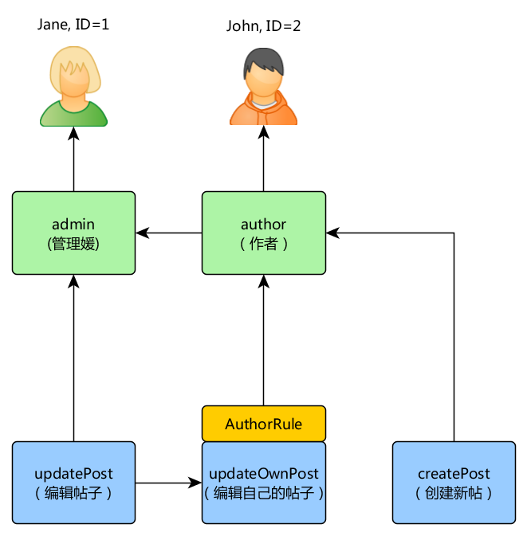

#授权

授权是指检验用户是否有权限做某件事的过程。`Yii`提供了两种授权方式：权限控制过滤器（ACF）和基于角色的权限控制（RBAC）。

-----------------------------
##权限控制过滤器

权限控制过滤器是一个通过`yii\filters\AccessControl`类来实现的一个简单的权限验证方法。本方法适用于简单的权限控制。顾名思义，权限控制过滤器是一个应用于控制器或模块的动作过滤器。当用户请求执行某动作时，权限控制过滤器会检查访问规则列表以判断用户是否有权访问请求的俄动作。  
以下代码演示了如何在`site`控制器中使用权限控制过滤器：
```php

use yii\web\Controller;
use yii\filters\AccessControl;

class SiteController extends Controller
{
    public function behaviors()
    {
        return [
            'access' => [
                'class' => AccessControl::className(),
                'only' => ['login', 'logout', 'signup'],
                'rules' => [
                    [
                        'allow' => true,
                        'actions' => ['login', 'signup'],
                        'roles' => ['?'],
                    ],
                    [
                        'allow' => true,
                        'actions' => ['logout'],
                        'roles' => ['@'],
                    ],
                ],
            ],
        ];
    }
    // ...
}
```

以上代码中，权限控制过滤器以行为的方式绑定到了`site`控制器中。这是使用权限控制过滤器的典型方法。`only`选项表示，权限控制过滤器只对`login`,`logout`和`signup`动作起作用。所有`site`控制器内其他的动作不受权限控制过滤器的闲置。`rule`选项列出了访问规则，解读如下：

- 允许所有访客（未授权）用户浏览`login`和`signup`两个动作。`role`选项中的问号`?`表示“访客”。
- 允许已授权的用户浏览`logout`，符号`@`是另一个特殊标记，代表“已授权用户”。

权限控制过滤器自上而下逐一检查访问规则，直到找出与当前欲执行动作相匹配的规则。匹配的规则中`allow`的值将会用于判断用户是否被授权。假如没有规则匹配，这就意味着用户没有被授权，权限控制过滤器会停止之后的动作解析。（译者注： only 中没有列出的操作，将无条件获得授权）

当 ACF 判定一个用户没有获得执行当前操作的授权时，它的默认处理是：

- 如果用户是访客，权限控制过滤器会调用`yii\web\User::loginRequired()`将用户重定向到登录页面。
- 假如用户已经登录，就会抛出`yii\web\ForbiddenHttpException`异常。

你可以通过配置 yii\filters\AccessControl::denyCallback 属性定制该行为：
```php
[
    'class' => AccessControl::className(),
    ...
    'denyCallback' => function ($rule, $action) {
        throw new \Exception('You are not allowed to access this page');
    }
]
``` 
访问规则支持很多选项，以下是对支持选项的总结。还可以通过扩展`yii\filters\AccessRule`去创建自己的访问规则类：

- `allow`: 指定该规则是 "允许" 还是 "拒绝" 。（译者注：`true`是允许，`false`是拒绝）。
- `actions`: 指出本规则匹配哪个动作。本选项的值是一个由控制器动作ID组成的数组。匹配比较是大小写敏感的。如果该选项为空，或者不使用该选项， 意味着当前规则适用于所有的动作。
- `controllers`: 指出本规则匹配哪个控制器，本选项的值是由控制器ID组成的数组。每个控制器ID前面都要尽可能加上模块ID前缀。匹配比较是大小写敏感的。如果该选项为空，或者不使用该选项， 意味着当前规则适用于所有的控制器。（译者注：这个选项一般是在控制器的自定义父类中使用才有意义）
- `roles`: 指出本规则适用于哪种角色的用户。框架识别两种用户，它们都是通过`yii\web\User::$isGuest`属性识别的：
    `?`: 匹配游客用户
    `@`: 匹配已登录用户

    使用其他角色名将会触发`yii\web\User::can()`方法。本方法需要开启`RBAC`（在下一节中阐述）。 如果该选项为空或者不使用该选项，意味着该规则适用于所有角色。
- `ips`: 指出本规则适用于哪些客户端IP地址，IP地址可以在末尾包含`*`通配符以匹配相同前缀的IP地址，例如`192.168.*`匹配所有`192.168.`段的地址。如果该选项为空或者不使用该选项，意味着该规则适用于所有IP地址。
- `verbs`: 指出本规则适用于哪些HTTP方法，本规则大小写不敏感。
- `matchCallback`: 指定一个PHP回调函数用于 判定该规则是否满足条件。（译者注：此处的回调函数是匿名函数）
- `denyCallback`: 指定一个PHP回调函数， 当这个规则不满足条件时该函数会被调用。（译者注：此处的回调函数是匿名函数）

以下例子展示了如何使用`matchCallback`选项， 可使你设计任意的访问权限检查逻辑：
```php
use yii\filters\AccessControl;

class SiteController extends Controller
{
    public function behaviors()
    {
        return [
            'access' => [
                'class' => AccessControl::className(),
                'only' => ['special-callback'],
                'rules' => [
                    [
                        'actions' => ['special-callback'],
                        'allow' => true,
                        'matchCallback' => function ($rule, $action) {
                            return date('d-m') === '31-10';
                        }
                    ],
                ],
            ],
        ];
    }

    /**
    *  匹配的回调函数被调用了！这个页面只有每年的10月31号
    *  能访问（译者注：原文在这里说该方法是回调函数不确切，
    *  读者不要和 `matchCallback` 的值即匿名的回调函数混淆理解）。
    */
    public function actionSpecialCallback()
    {
        return $this->render('happy-halloween');
    }
}
```

--------------------------------
##基于角色的权限控制（RBAC）
基于角色的权限控制（RBAC）提供了一个简单而强大的集中访问控制。想要了解跟过关于`RBAC`与其他传统访问控制方案的对比，请参考[维基百科](https://en.wikipedia.org/wiki/Role-based_access_control)。  
Yii实现了一种通用分层的基于角色的权限控制（即上层的角色可以继承下层的所有权限），遵循[NIST RBAC](csrc.nist.gov/rbac/sandhu-ferraiolo-kuhn-00.pdf)模型。他通过`yii\rbac\ManagerInterface` `授权管理组件`提供基于角色的权限控制功能。  
使用`RBAC`包含两个步骤：首先，建立`RBAC`授权数据，第二部，在需要的地方使用授权数据执行访问检查。  
为了方便我们接下来的描述，先介绍`RBAC`的一些基本概念。

###基本概念

角色，是权限的集合（例如发布文章，修改文章等待）。一个角色可以指派给一个或多个用户。要检查一个用户是否有某项权限，可以检查该用户是否分配了某个包含该权限的角色。  
可能会有一个`规则`联系每个角色或权限，规则用一段代码表示，该代码会在判断是否指定的角色或权限适用于当前用户时执行。例如，“修改文章”这个权限可能会有一个检查当前用户是不是文章创建者的规则。在检查权限期间，假如用户不是文章的创建者，那么他将不具备“修改文章”的权限。  
角色和权限都可以按层次进行组织。一个角色可能包含其他角色或权限，一个权限可能包含其他权限。Yii实现了所谓的`偏序`层次结构，包含更多的特殊的`树`层。 一个角色可以包含一个权限，反之则不行。（译者注：可理解为角色在上方，权限在下方，从上到下如果碰到权限那么再往下不能出现角色）。  

###配置`RBAC`

在我们开始定义授权数据和执行访问检查前，需要配置`yii\rbac\ManagerInterface``授权管理组件`。Yii提供了两种`授权管理组件`，分别是`yii\rbac\PhpManager`和`yii\rbac\DbManager`。前者使用PHP脚本文件储存授权数据，后者使用数据库储存授权数据。如果你的应用不需要大量的角色和权限管理，可以使用前者。

####使用`PhpManager`

以下代码演示了使用`yii\rbac\PhpManager`类作为`授权管理组件`的时候，在应用配置文件中如何进行配置：
```php
return [
    // ...
    'components' => [
        'authManager' => [
            'class' => 'yii\rbac\PhpManager',
        ],
        // ...
    ],
];
```

如此配置之后，`授权管理组件`现在可以通过`\Yii::$app->authManager`访问了。  
默认情况下，存放`RBAC`数据的`yii\rbac\PhpManager`类文件放在`@app/rbac`目录下。如果权限层次数据在运行时会被修改，请确认该目录以及该目录下的文件对WEB服务器程序是可写的。  

####使用`DbManager`

以下代码为您示范了使用`yii\rbac\DbManager`类作为`授权管理组件`的时候，在应用配置文件中如何进行配置：

```php
return [
    // ...
    'components' => [
        'authManager' => [
            'class' => 'yii\rbac\DbManager',
        ],
        // ...
    ],
];
```

`DbManager`类使用四张数据库表储存授权数据：

- `yii\rbac\DbManager::$itemTable`: 该表存放授权条目（译者注：即角色和权限）。默认表名为"auth_item"。
- `yii\rbac\DbManager::$itemChildTable`: 该表存放授权条目的层次关系。默认表名为  "auth_item_child"。
- `yii\rbac\DbManager::$assignmentTable`:  该表存放授权条目对用户的分配关系。默认表名为"auth_assignment"。
- `yii\rbac\DbManager::$ruleTable`:  该表存放规则。默认表名为"auth_rule"。

继续之前，你需要在数据库中创建这些表。你可以使用存放在 @yii/rbac/migrations 目录中的数据库迁移文件来做这件事（译者注：根据本人经验，最好是将授权数据初始化命令也写到这个 RBAC 数据库迁移文件中）

    yii migrate --migrationPath=@yii/rbac/migrations

如此配置之后，`授权管理组件`现在可以通过`\Yii::$app->authManager`访问了。  

###构建授权数据

构建授权数据主要包含以下几项任务：

- 定义角色和权限；
- 建立角色和权限之间的关系；
- 定义规则；
- 将规则与角色和权限进行关联；
- 为用户指派角色；

根据权限灵活度的要求，以上任务可以根据不同方式完成。  
如果你的权限层次不发生改变，且用户数量不变，你可以通过`授权管理组件`提供的API创建终端命令，一次性初始化授权数据。  

```php
<?php
namespace app\commands;

use Yii;
use yii\console\Controller;

class RbacController extends Controller
{
    public function actionInit()
    {
        $auth = Yii::$app->authManager;

        // 添加“发布文章”权限
        $createPost = $auth->createPermission('createPost');
        $createPost->description = 'Create a post';
        $auth->add($createPost);

        // 添加“修改文章”权限
        $updatePost = $auth->createPermission('updatePost');
        $updatePost->description = 'Update post';
        $auth->add($updatePost);

        // 添加“作者”角色，并为他赋予“发布文章”的权限。
        $author = $auth->createRole('author');
        $auth->add($author);
        $auth->addChild($author, $createPost);

        // 添加一个“管理员”角色，并为他赋予“修改文章”的权限。
        // 为他赋予“作者”角色的所有权限。
        $admin = $auth->createRole('admin');
        $auth->add($admin);
        $auth->addChild($admin, $updatePost);
        $auth->addChild($admin, $author);

        // 为用户指派角色，1和2是IdentityInterface::getId()方法返回的角色ID。
        // 通常在你的User模型中实现这个方法。
        $auth->assign($author, 2);
        $auth->assign($admin, 1);
    }
}
?>
```

在执行终端命令`yii rbac/init`后，会得到如下的权限层次结构：
  

角色`作者`可以发布文章，角色`管理员`可以修改文字和做一切作者可以做的事。  
假如你的应用允许用户注册，你需要为新用户分配角色。例如，为了给应用中所有新注册的用户分配`作者`角色，在高级项目模板中，你需要像这样修改`frontend\models\SignupForm::signup()`方法：

```php
public function signup()
{
    if ($this->validate()) {
        $user = new User();
        $user->username = $this->username;
        $user->email = $this->email;
        $user->setPassword($this->password);
        $user->generateAuthKey();
        $user->save(false);

        // 添加以下三行代码：
        $auth = Yii::$app->authManager;
        $authorRole = $auth->getRole('author');
        $auth->assign($authorRole, $user->getId());

        return $user;
    }

    return null;
}
```

对于有动态更改授权数据的复杂存取控制需求的应用，你可能需要使用`授权管理组件`提供的 API 的开发用户界面（例如：管理面板）。

###使用规则

如前所述，规则为角色和权限添加了额外的约束。规则是一个继承自`yii\rbac\Rule`的类，必须实现`execute()`方法。在之前我们创建的权限层次中，`作者`角色不能够编辑自己发布的文章。我们来修正这个问题，首先我们需要一个规则去验证当前用户是否是文章作者：

```php
namespace app\rbac;

use yii\rbac\Rule;

/**
 * 检查 authorID 是否和通过参数传进来的 user 参数相符
 */
class AuthorRule extends Rule
{
    public $name = 'isAuthor';

    /**
     * @param string|integer $user 用户 ID.
     * @param Item $item 该规则相关的角色或者权限
     * @param array $params 传给 ManagerInterface::checkAccess() 的参数
     * @return boolean 代表该规则相关的角色或者权限是否被允许
     */
    public function execute($user, $item, $params)
    {
        return isset($params['post']) ? $params['post']->createdBy == $user : false;
    }
}
```

以上的代码检查了`文章`是否由指定的`$user`创建。使用之前提到的控制点命令创建一个特殊权限`修改自己的文章`：

```php
$auth = Yii::$app->authManager;

// 添加规则
$rule = new \app\rbac\AuthorRule;
$auth->add($rule);

// 添加 "updateOwnPost" 权限并与规则关联
$updateOwnPost = $auth->createPermission('updateOwnPost');
$updateOwnPost->description = 'Update own post';
$updateOwnPost->ruleName = $rule->name;
$auth->add($updateOwnPost);

// "updateOwnPost" 权限将由 "updatePost" 权限使用
$auth->addChild($updateOwnPost, $updatePost);

// 允许 "author" 更新自己的帖子
$auth->addChild($author, $updateOwnPost);
```

现在我们得到如下的权限层次结构：

  

###权限检查

准备好授权数据后，权限检查只需要简单的调用`yii\rbac\ManagerInterface::checkAccess()`方法。因为大多数权限检查都是针对当前用户，因此，方便起见，有一个快捷方法`yii\web\User::can()`使用方法如下： 

```php
if (\Yii::$app->user->can('createPost')) {
    // 新增文章
}
```

如果当前用户是`ID=1`的`Jane`，我们将试图为`Jane`获取`发布文章`的权限。（译者注：参照图中红色路线所示的发布文章授权流程）

  

为了检查用户是否能编辑文章，我们需要传递一个 由之前我们提到的`AuthorRule`类 提供的参数。

```php
if (\Yii::$app->user->can('updatePost', ['post' => $post])) {
    // 更新文章
}
```

下图是，当前用户为`John`时发生的判断逻辑：

  

我们从图中的`updatePost`开始，经过`updateOwnPost`。为通过检查，`Authorrule`规则的`execute()`方法应当返回`true`。该方法从`can()`方法调用接收到`$params`参数， 因此它的值是`['post' => $post]`。如果一切顺利，我们会达到指派给`John`的`author`角色。

对于`Jane`来说则更简单，因为她是管理员：

  

###使用默认角色

所谓默认角色，是隐式地分配给所有用户的角色。不需要显式地调用`yii\rbac\ManagerInterface::assign()`方法，并且授权数据中不包含指派信息。  
默认角色通常与规则相关联，用来判断规则是否适用于该用户。  
默认角色常常用于已经确立了一些角色的指派关系的应用（译者注：指派关系指的是应用业务逻辑层面， 并非指授权数据的结构）。比如，一个应用的`user`表中有一个`group`字段，代表用户属于哪个特权组。如果每个特权组可以映射到`RBAC`的角色，你就可以采用默认角色自动地为每个用户指派一个`RBAC`角色。 让我们用一个例子展示如何做到这一点。  
假设在`user`表中，你有一个`group`字段，用1代表管理员组，用2表示作者组。 你规划两个`RBAC`角色`admin`和`author`分别对应这两个组的权限。 你可以这样设置`RBAC`数据：

```php
namespace app\rbac;

use Yii;
use yii\rbac\Rule;

/**
 * 检查是否匹配用户的组
 */
class UserGroupRule extends Rule
{
    public $name = 'userGroup';

    public function execute($user, $item, $params)
    {
        if (!Yii::$app->user->isGuest) {
            $group = Yii::$app->user->identity->group;
            if ($item->name === 'admin') {
                return $group == 1;
            } elseif ($item->name === 'author') {
                return $group == 1 || $group == 2;
            }
        }
        return false;
    }
}

$auth = Yii::$app->authManager;

$rule = new \app\rbac\UserGroupRule;
$auth->add($rule);

$author = $auth->createRole('author');
$author->ruleName = $rule->name;
$auth->add($author);
// ... 添加$author角色的子项部分代码 ... （译者注：省略部分参照之前的控制台命令）

$admin = $auth->createRole('admin');
$admin->ruleName = $rule->name;
$auth->add($admin);
$auth->addChild($admin, $author);
// ... 添加$admin角色的子项部分代码 ... （译者注：省略部分参照之前的控制台命令）
```

注意，在上述代码中`作者`角色被添加为`管理员`的子角色。所以，当你实现这个规则的`execute()`方法时，你也要遵循这个权限层次结构。这就是为何当角色名为 "author" 的情况下（译者注：$item->name就是角色名），`execute()`方法在组为1或者2时均要返回`true`（意思是用户属于 "admin" 或者 "author" 组 ）。  
接下来，使用这两种角色为应用配置`授权管理组件`配置`yii\rbac\BaseManager::$defaultRoles`属性：
```php
return [
    // ...
    'components' => [
        'authManager' => [
            'class' => 'yii\rbac\PhpManager',
            'defaultRoles' => ['admin', 'author'],
        ],
        // ...
    ],
];
```

Now if you perform an access check, both of the admin and author roles will be checked by evaluating the rules associated with them. If the rule returns true, it means the role applies to the current user. Based on the above rule implementation, this means if the group value of a user is 1, the admin role would apply to the user; and if the group value is 2, the author role would apply.