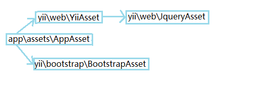

##警惕啊资源包相关笔记

`view`类和`controller`类互相配合，递归实现对视图文件的渲染。渲染之前的相关细节本文不做讨论。本文主要研究的是`AssetBundle`静态资源包类与`AssetManager`静态资源管理器类、`AssetConverterInterface`静态资源转换器接口互相配合工作以管理视图的静态资源。

从默认布局文件`views/layouts/main.php`中的代码入手：
```php
<?php

/* @var $this \yii\web\View */
/* @var $content string */

...

AppAsset::register($this);
?>
```

代码注释中已经写明了`$this`为`\yii\web\View`类，而`AppAsset`位于`app\assets`命名空间下，同时为`yii\web\AssetBundle`的子类，因此有:
```php
<?php
class AppAsset extends AssetBundle
{
    // 字符串，对web服务软件可读的，包含处理后的静态资源文件包的文件夹。
    public $basePath = '@webroot';
    // 字符串，静态资源文件的基本URL地址
    public $baseUrl = '@web';
    // 数组，本资源包包含的CSS文件列表。
    public $css = [
        'css/site.css',
    ];
    // 数组，本资源包包含的JS文件列表
    public $js = [
    ];
    // 数组，当前静态资源库依赖的其他资源库类名。
    public $depends = [
        'yii\web\YiiAsset',
        'yii\bootstrap\BootstrapAsset',
    ];

    // 将本静态资源包注册到一个视图对象中。
    public static function register($view = '\yii\web\View')
    {
        return $view->registerAssetBundle(get_called_class() = 'app\assets\AppAsset');
    }
}
?>
```

在这里app\assets\AppAsset::register()方法调用View视图类的registerAssetBundle()方法对当前静态资源包进行注册，而当前静态资源包又有以下依赖关系：
